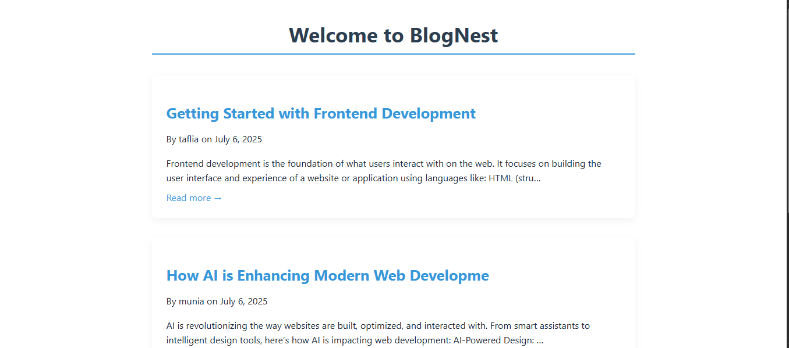

# 📘 BlogNest

**BlogNest** is a clean and minimal blog platform built with Django.  
Perfect for beginners to learn how Django apps work using models, views, templates, and static files.

## 📸 Features

- Simple and elegant homepage for blog posts
- Full post reading with clean typography
- Easy post creation through Django Admin
- Pure CSS design (no frameworks like Bootstrap)

## 🚀 Getting Started (Windows)

### 1. Clone the Project

If you're using Git:

git clone https://github.com/Munia-Mim/BlogNest.git

cd BlogNest

### 2. Create and Activate Virtual Environment

python -m venv venv

venv\Scripts\activate

### 3. Install Django

pip install django

### 4. Apply Migrations

python manage.py migrate

### 5. Create Superuser (admin login)

python manage.py createsuperuser

Follow the prompts for username, email, and password.

### 6. Run the Development Server

python manage.py runserver

Now open in your browser:
🔗 [http://127.0.0.1:8000/](http://127.0.0.1:8000/) — homepage  
🔐 [http://127.0.0.1:8000/admin](http://127.0.0.1:8000/admin) — admin panel  

## 📁 Project Structure (Detailed)  
  
Blog-Website/  
│  
├── blog/                      # The blog app    
│   ├── migrations/            # Auto-created DB migration files  
│   ├── templates/  
│   │   └── blog/  
│   │       ├── home.html      # Blog homepage template  
│   │       └── post_detail.html # Blog post detail view  
│   ├── __init__.py  
│   ├── admin.py               # Admin config for Post model  
│   ├── apps.py  
│   ├── models.py              # Post model definition  
│   ├── tests.py  
│   └── views.py               # Views for list & detail  
│  
├── blog_project/              # Project settings and URLs  
│   ├── __init__.py  
│   ├── settings.py            # Settings file (edited for static/css support)  
│   ├── urls.py                # Main URL routing  
│   └── wsgi.py  
│  
├── static/  
│   └── style.css              # Global CSS styles for the blog  
│  
├── db.sqlite3                 # Default SQLite database  
├── manage.py                  # Django management script  
├── venv/                      # Virtual environment (not uploaded to GitHub)  
└── README.md                  # This file  

## 📸 Screenshots

Here are some previews of BlogNest in action:

### 🖥️ Homepage

## 🧠 Tech Stack

* **Language**: Python 3.x
* **Framework**: Django 5.0.6
* **Database**: SQLite
* **Frontend**: HTML + CSS (pure)

## ✍️ Author

Made with 💙 by Munia Zaman Mim & Taflia Akter Mim
Inspired by learning Django step by step.

